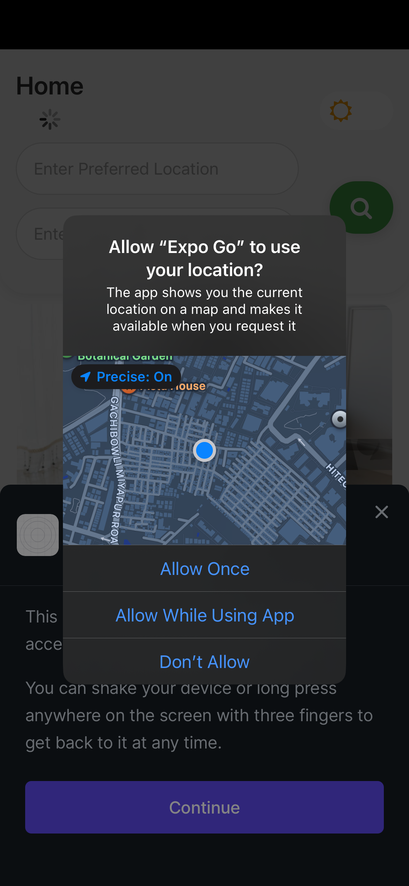
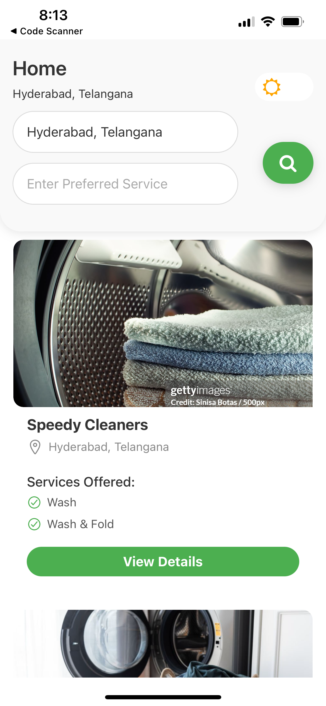
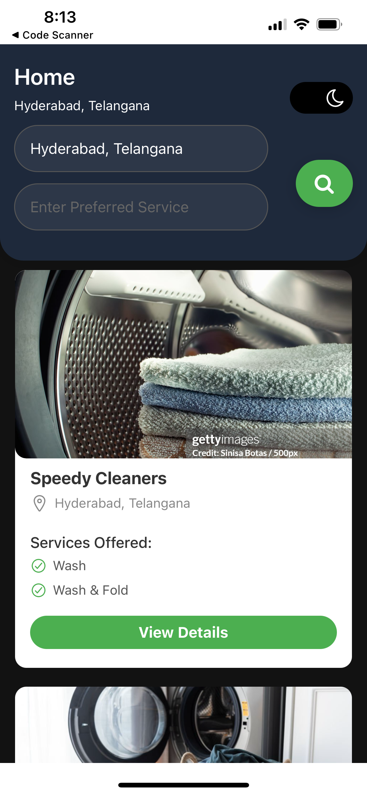
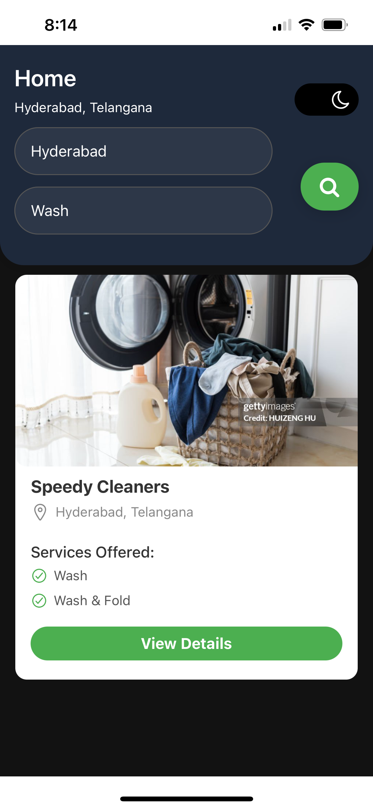
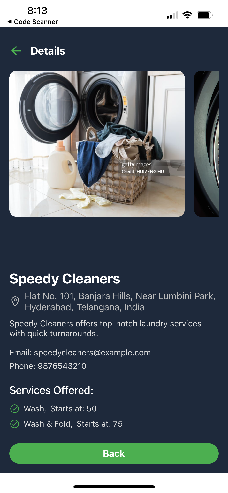

# Laundry Service App
This Android application allows customers to search for laundry vendors based on their location or the services they offer. The app includes vendor details with address details, as well as the ability to switch between day and night themes for a better user experience.

## Features

- **Search for Vendors:** Customers can search for vendors based on their location or services offered (e.g., wash, dry cleaning, ironing).
- **Location-Based Search:** The app uses the user's current location to find vendors near them.
- **Vendor Details:** Displays vendor information including name, location, and services offered.
- **Day/Night Theme:** The app supports a day and night mode theme for a better user experience.
- **Vendor Services:** Each vendor offers a set of unique laundry services.

## Screenshots

    
    
   

     
    
  

    
  

## Description

Above are some screenshots of the application:

- Home screen where users can search for vendors.

- Toggle feature to change the app theme

- List of vendors based on the user's search.

- Detailed view of a selected vendor with available services.
